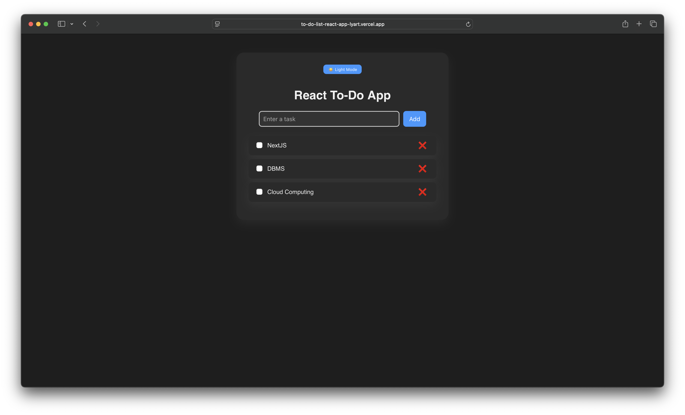
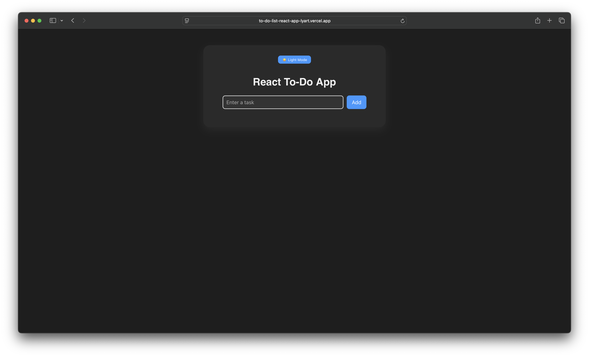
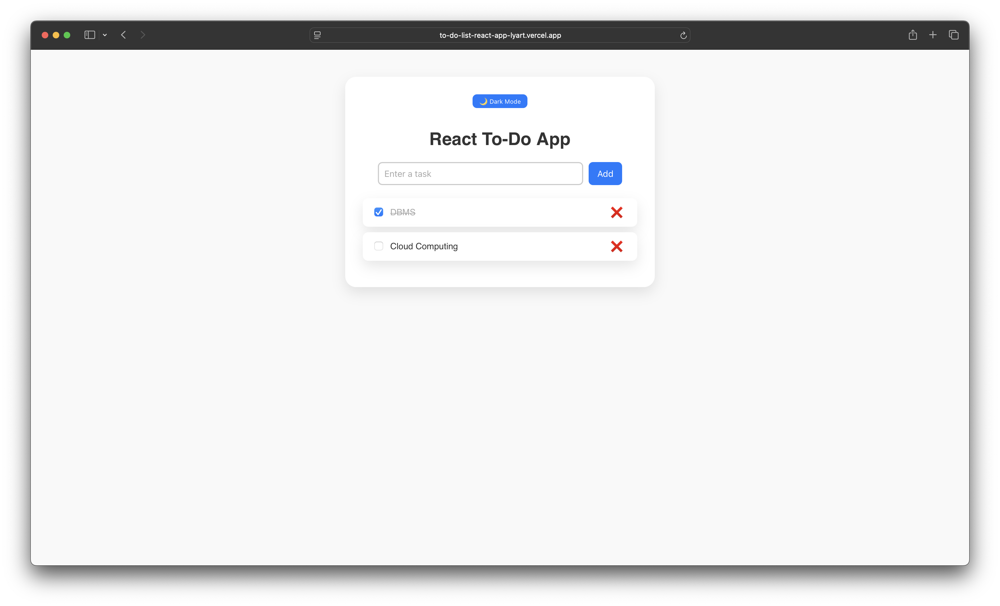
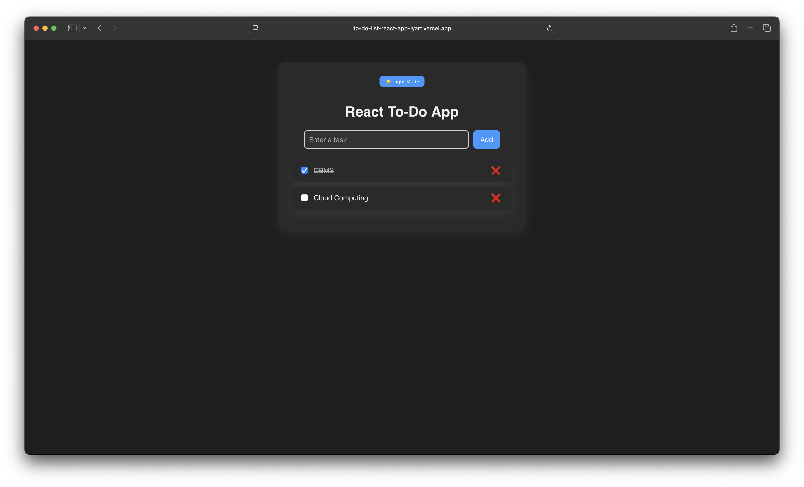

# 📝 React To-Do App

A beautiful and responsive To-Do List application built using **React**. Easily add, complete, and delete tasks with a checkbox-style interface, smooth animations, and dark/light mode support. Fully deployed and accessible online using **Vercel**.

---

## 🚀 Live Demo

🔗 [Click here to use the app]()  

---

## 📸 Screenshots

| Feature                       | Screenshot |
|------------------------------|------------|
| ✅ Add Tasks                 |  |
| 🌙 Dark Mode                |  |
| ☀️ Light Mode               |  |
| 🗑️ Remove Completed Tasks   |  |

---

## ⚙️ Features

✅ Add tasks  
✅ Mark tasks as complete/incomplete  
✅ Delete tasks  
✅ Dark/Light mode toggle 🌗  
✅ Checkbox toggle with smooth animations  
✅ Responsive design for all screen sizes 📱  
✅ Clean and modern UI  
✅ Easily deployable to Vercel

---

## 🛠️ Tech Stack

- **React** (with Hooks)
- **CSS** (for styling and animations)
- **Vercel** (deployment)

---

## 📁 Project Structure

```
todo-app/
├── public/
│   ├── index.html
│   └── favicon.ico
├── src/
│   ├── App.js
│   ├── App.css
│   └── components/
│       ├── TodoInput.js
│       ├── TodoList.js
│       └── TodoItem.js
├── package.json
└── README.md
```

---

## 🧑‍💻 How to Run Locally

```bash
# 1. Clone the repo
git clone https://github.com/himanshumudigonda/todo-app.git

# 2. Navigate into the folder
cd todo-app

# 3. Install dependencies
npm install

# 4. Start development server
npm start
```


## ✨ Future Ideas

- Task filters (All / Active / Completed)
- LocalStorage support
- Due dates & priorities
- Edit tasks in-place
- Animations for delete/complete

---

## 📬 Contact

**Himanshu Mudigonda**  
📧 himanshumudigonda@gmail.com  
🔗 [LinkedIn](https://www.linkedin.com/in/himanshu-mudigonda-09a9ba29b/)  
💻 [GitHub](https://github.com/mudigondahimanshu)  


---

## 🧾 License

This project is licensed under the MIT License — use it freely in personal or commercial projects.

---
